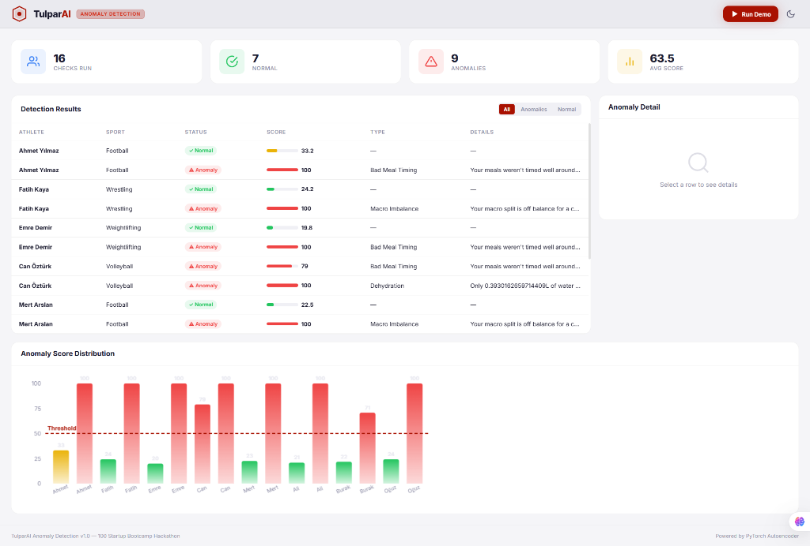
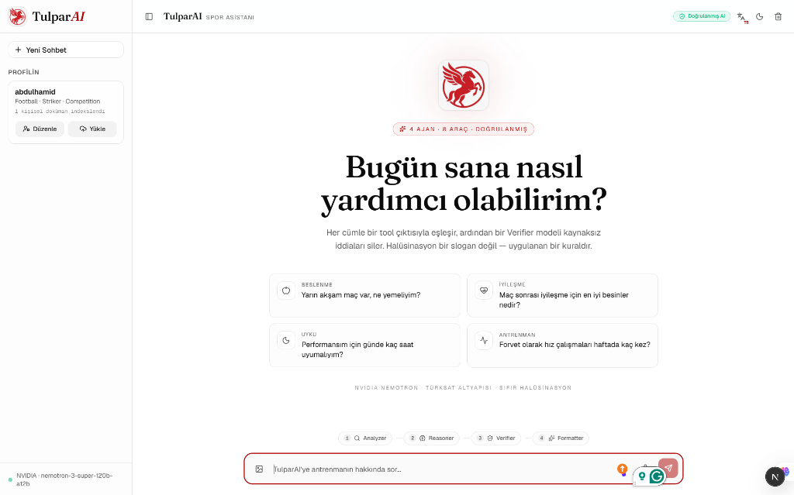
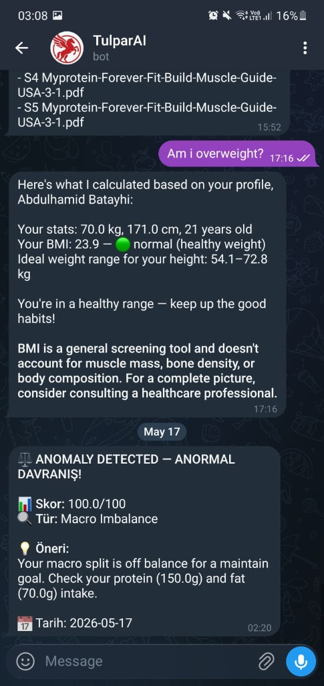
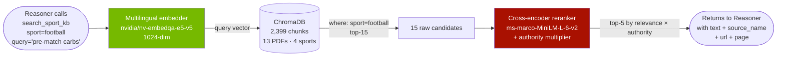
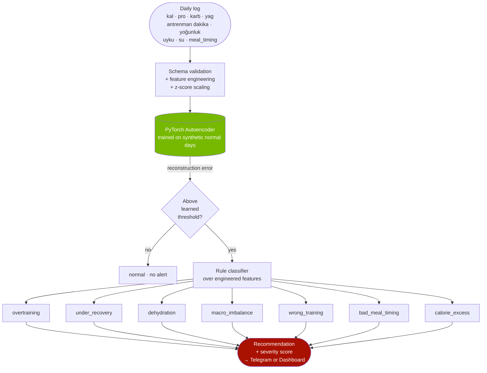

<div align="center">
  
  <h1>🐎 TulparAI</h1>
  <p><b>Türk Sporcular için Doğrulanmış AI Antrenör</b></p>
  
  <p>
    
    
    
    
  </p>
  
  <p>
    <em>A local multi-model multi-agent, tool-using, <b>citation-verified</b> AI adviser for Turkish athletes — built for the<br>
    <b>100 StartUP Bootcamp Hackathon (YTÜ × Türksat × NVIDIA), 15–17 May 2026.</b></em>
  </p>
  <p><b>Theme codes:</b> <code>A5 · B2 · C1 · C2 · C3 · C5 · C6 · C7 · D5 · D7</code></p>
</div>

---

## 🌟 The Pitch in One Paragraph

Most AI agents call tools and blindly trust the model. **TulparAI calls tools, forces the model to cite each tool's output by index `[T1] [T2]`, and then runs a strict Verifier model that strips any claim the tools didn't explicitly support.** Zero hallucinations is not a marketing slogan — it's an enforced system invariant. 

Running in parallel is our **Anomaly Detection Module**, which silently watches each athlete's daily log stream (macros, training load, hydration, sleep) and flags overtraining, weight-cut risk, RED-S, or macro imbalances *before* they become injuries. 

Deployed on Türksat-compatible NVIDIA infrastructure, TulparAI is ready for the **Gençlik ve Spor Bakanlığı** to give every athlete in Turkey a personal, fully-cited coach, dietitian, and early-warning system via Web, Telegram, or Voice.

---

## 📸 See It In Action

### 1. Anomaly Detection Dashboard (Always-On Guardian)
*(Please place your anomaly detection image here as `docs/assets/anomaly-dashboard.png`)*

> *The parallel anomaly module flags 7 types of risks from daily logs. It runs completely independent of the LLM pipeline, acting as a silent guardian for athlete health.*

### 2. Conversational Web Interface
*(Please place your web chat image here as `docs/assets/web-chat.png`)*

> *Onboarding is natural and conversational. The multi-agent system uses RAG against a sport-filtered ChromaDB and verifies every claim.*

### 3. Telegram Bot Integration
*(Please place your telegram bot image here as `docs/assets/telegram-bot.jpg`)*

> *Multi-tenant Telegram integration allows athletes to log meals and workouts on the go, triggering the anomaly detector instantly.*

---

## 🚀 Key Features

A sport-specific (football · wrestling · weightlifting · volleyball), personalized (profile + recent training/meal logs), and **verified** AI adviser.

| Capability | How it works |
|---|---|
| **Chat (TR + EN)** | SSE streamed, live agent badges, real-time tool-call chips. |
| **Conversational Onboarding** | Agent asks facts step-by-step, calling `update_profile` to persist data. |
| **Context-Aware** | Personal facts answered directly from the profile—no unnecessary web lookups. |
| **Vision Analysis** | Photo a meal/injury/pose → NVIDIA VLM extracts info automatically. |
| **Voice Interaction** | Web Speech API mic integration for Türkçe & English. |
| **Personal RAG** | Upload training plans or bloodwork to create a per-athlete Knowledge Base. |
| **Telegram Bot** | Each user gets a profile; use `/log` for daily check-ins. |
| **Anomaly Detection** | Local PyTorch autoencoder flags 7 anomaly types from daily metrics. |
| **Zero Hallucination** | Every claim `[Tx]` resolves to a real tool response. |
| **Sport-Filtered KB** | ChromaDB metadata `where={"sport": ...}` guarantees zero cross-sport contamination. |

---

## 🧠 Architecture: The Multi-Agent Pipeline

The chat pipeline is a 4-agent state machine driven by `backend/orchestrator.py`. Each transition emits an SSE event so the frontend can animate the live agent badges.


### 🛡️ Why This Architecture?
1. **Regex Fast-Path:** Simple greetings skip the LLM entirely (<50ms).
2. **Dynamic Verification:** We skip the Verifier when the answer has no `[Tx]` markers, saving ~3s.
3. **Image Auto-Injection:** Image bytes are pre-filled into any `analyze_image` tool call by the orchestrator. The LLM never has to carry a heavy base64 blob in its context.

---

## 🔍 RAG — Sport-Filtered, Authority-Weighted, Multilingual

Our `search_sport_kb` tool queries a ChromaDB collection where every chunk carries `sport`, `lang`, `source_type`, and `authority_score` metadata. **Cross-sport contamination is impossible.**



**Authority weighting:** (Multiplied into the rerank score)
- **1.00:** IOC / WHO / Government
- **0.90:** Federation (UEFA, FIFA, TFF, etc.)
- **0.85:** Peer-reviewed journal (BJSM, JISSN)
- **0.80:** National institute (AIS, USOC)

*A Turkish query against an English corpus works natively via our multilingual embedder!*

---

## ⚕️ Anomaly Detection — The Silent Guardian

Located at `backend/anomaly/`, a PyTorch autoencoder learns the user's "normal" daily pattern (macros, training load, sleep) and flags deviations. 



*This detector is completely independent of the chat pipeline, runs locally in milliseconds, and works offline.*

---

## 🤖 Models We Use

Every model is pinned by `.env` key. Together, they form a highly efficient inference budget running on free NVIDIA quota.

| Role | Model | Environment | Why this choice? |
|---|---|---|---|
| **Reasoner** | `nvidia/nemotron-3-super-120b-a12b` |Local CPU/GPU | 120B-class MoE quality at low latency. Native tool-calling & multilingual. |
| **Analyzer/Verifier** | `nvidia/nvidia-nemotron-nano-9b-v2` | Local CPU/GPU | Extremely fast JSON-mode responses for intent extraction and claim-checking. |
| **Embedder** | `nvidia/nv-embedqa-e5-v5` | `build.nvidia.com` | 1024-dim multilingual embedder. TR query ↔ EN chunk works natively. |
| **Reranker** | `cross-encoder/ms-marco-MiniLM-L-6-v2` | Local CPU/GPU | High accuracy reranking of top-15 to top-5, applying our source authority multiplier. |
| **Vision** | `meta/llama-3.2-90b-vision-instruct` | Local CPU/GPU | Strong meal/form-check vision. |
| **Anomaly** | Custom PyTorch Autoencoder | Local PyTorch | Learns individual user patterns efficiently. |

*Why we didn't train our own 120B LLM in 38 hours: Our novelty is the **architecture**—tool-bound evidence markers, sport-filtered RAG, and parallel anomaly detection.*

---

## 🛠️ The Reasoner's Tool Arsenal

| # | Tool | Purpose |
|---|---|---|
| 1 | `search_sport_kb` | Primary RAG with ChromaDB + authority-weighted reranker. |
| 2 | `get_food_macros` | USDA FoodData + Open Food Facts. |
| 3 | `calc_macros` | Pure-Python Mifflin-St Jeor × sport PAL calculation. |
| 4 | `get_weather` | OpenWeather data for outdoor-training adjustments. |
| 5 | `log_session` | SQLite log writer to influence future recommendations. |
| 6 | `web_search_trusted` | Domain-whitelisted Tavily search (FIFA/UEFA/IOC/etc.). |
| 7 | `analyze_image` | Image understanding via NVIDIA VLM. |
| 8 | `update_profile` | Conversational onboarding mechanism. |

---

## 💻 Tech Stack

- **AI/LLM:** multi-local model
- **Backend:** Python 3.11, FastAPI, ChromaDB, SQLite, PyTorch, Scikit-Learn
- **Frontend:** Next.js 16, React 19, Tailwind 4, Fraunces + Geist Fonts
- **Deployment:** Vercel (Frontend), NVIDIA Brev Tunnel (Backend)

---

## ⚙️ Quick Start (Local Setup)

```bash
git clone https://github.com/abdulhamidbatayhi123/TulparAI.git
cd TulparAI

# --- Backend ---
cd backend
python -m venv .venv
.venv\Scripts\activate            # Windows
# source .venv/bin/activate       # macOS / Linux
pip install -r requirements.txt
cp .env.example .env              # add your API keys!

# Initialize DB & Seed Demo Athletes
python -m backend.scripts.seed_demo

# Start API Server
uvicorn backend.main:app --reload --port 8000

# --- Frontend (New Terminal) ---
cd ../frontend
npm install
cp .env.example .env.local        # Set NEXT_PUBLIC_BACKEND_URL=http://localhost:8000
npm run dev                       # Opens http://localhost:3000

# --- Telegram Bot (Optional) ---
# Add TELEGRAM_BOT_TOKEN to backend/.env
python -m backend.telegram_bot
```

---

## 🏆 Hackathon Theme Alignment

| Code | How TulparAI hits it |
|---|---|
| **A5** | Every athlete gets a personal coach, making performance support accessible to all. |
| **B2** | Built for GSB / Türksat; completely legally defensible thanks to our strict Verifier model. |
| **C1** | 4-agent pipeline: Analyzer → Reasoner → Verifier → Formatter. |
| **C2** | OpenAI-style function calling with 8 robust and deeply integrated tools. |
| **C3** | Sport-filtered, authority-weighted, multilingual RAG system. |
| **C5** | Integrated Vision (NVIDIA VLM) and Voice (Web Speech API) capabilities. |
| **C6** | Scalable containerized micro-architecture deployments through NVIDIA infrastructure. |
| **C7** | Verifier strips unsupported claims; Anomaly Detector flags real health risks. |
| **D5** | Optimized data-pipelines and caching mechanisms for immediate real-time retrieval. |
| **D7** | Türksat-compatible NVIDIA build, Turkish-first UX, TFF/TWF federation whitelists. |

---

## 👨‍💻 Team
- **Abdulhamid Batayhi** — Architect / Backend / AI / Frontend / Data ([@abdulhamidbatayhi123](https://github.com/abdulhamidbatayhi123))
    zahid sinan yilmaz
    abdulrahman alshoura 

> *Tulpar — the winged horse of Turkic mythology. Swift, fearless, and never lost.*

<div align="center">
  <sub>Built with ❤️ for the 100 StartUP Bootcamp. MIT License.</sub>
</div>
