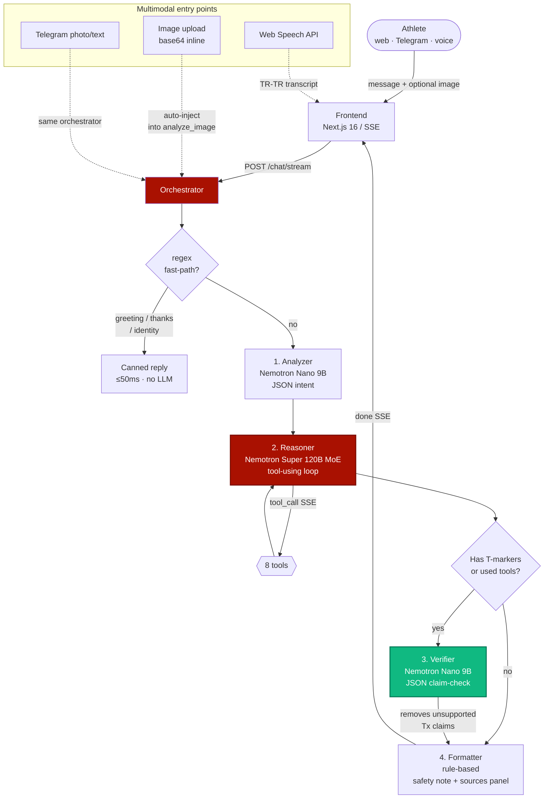
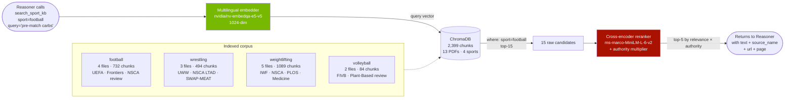
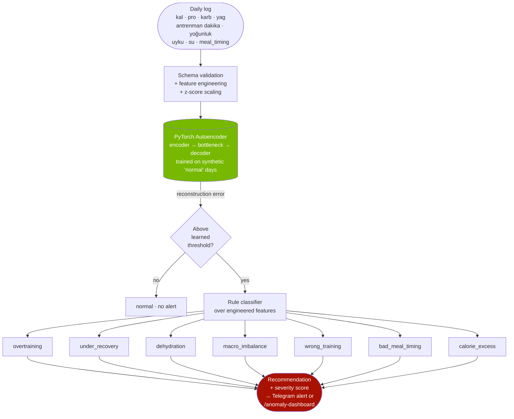

# 🐎 TulparAI — Türk Sporcular için Doğrulanmış AI Antrenör

> A multi-agent, tool-using, **citation-verified** AI adviser for Turkish athletes — built for the
> **100 StartUP Bootcamp Hackathon (YTÜ × Türksat × NVIDIA), 15–17 May 2026.**

**Theme codes:** `A3 Kapsayıcılık · B2 Kamuda AI Dönüşümü · C1, C2, C3, C5, C7 · D7`

> *Tulpar* — the winged horse of Turkic mythology. Swift, fearless, and never lost.

---

## The pitch in one paragraph

Most agents call tools and trust the model. **TulparAI calls tools, makes the model cite each
tool's output by index `[T1] [T2]`, then runs a separate Verifier model that strips any claim
the tools didn't support.** Zero hallucinations is not a slogan — it's an enforced invariant.
A parallel **anomaly-detection module** silently watches each athlete's daily log stream
(macros, training load, hydration, sleep) and flags overtraining, weight-cut risk, RED-S,
or macro imbalances before they become injuries. Deployed on Türksat-compatible NVIDIA
infrastructure, ready for the Gençlik ve Spor Bakanlığı to give every athlete in Turkey a
personal cited coach + dietitian + early-warning system via web, Telegram, or voice.

---

## What it does

A sport-specific (football · wrestling · weightlifting · volleyball), personalised
(profile + recent training/meal logs), verified (every factual claim cited and re-checked
against the tool that produced it) AI adviser. **Onboarding is conversational** — on first
chat the agent asks you step-by-step for the facts it needs and persists them so the
profile becomes the foundation of every later answer (just like `CLAUDE.md` is for Claude).

| Capability | How |
|---|---|
| Chat (TR + EN, runtime toggle) | SSE streamed, live agent badges, live tool-call chips |
| Conversational onboarding | Agent asks one fact at a time, calls `update_profile` to persist |
| Context-aware | Personal facts answered from profile — no spurious web lookups |
| Vision | Photo a meal / injury / pose → NVIDIA VLM extracts info |
| Voice | Web Speech API mic, Türkçe + English |
| Personal RAG | Upload your training plan / bloodwork → per-athlete KB |
| Multi-tenant | Telegram bot — each user gets their own profile, `/log` for daily check-ins |
| Anomaly detection | Local PyTorch autoencoder flags 7 anomaly types from daily logs |
| Cited answers | Every `[Tx]` claim resolves to a real tool response |
| Verified | A second LLM strips any claim its tool didn't support |
| Sport-filtered KB | ChromaDB metadata `where={"sport": ...}` — zero cross-sport contamination |

---

## Architecture

### 1. Multi-modal multi-agent flow

The chat pipeline is a 4-agent state machine driven by `backend/orchestrator.py`. Each
transition emits an SSE event so the frontend can animate the live agent badges.



**Why this shape**

1. **Regex fast-path** — greetings/thanks/identity skip the LLM entirely (<50ms).
2. **Skip the Verifier** when the answer has no `[Tx]` markers and no tools were called — saves ~3s.
3. **Image auto-injection** — the image bytes are pre-filled into any `analyze_image` tool call by the orchestrator, so the LLM doesn't carry a base64 blob around in its context.

### 2. RAG — sport-filtered, authority-weighted, multilingual

The `search_sport_kb` tool is the primary RAG path. It runs against a ChromaDB collection
where every chunk carries `sport`, `lang`, `source_type`, and `authority_score` metadata.
Cross-sport contamination is impossible because the query filters at the database layer.



**Authority weighting** (multiplied into rerank score, classified at ingest time from filename):

| Authority | Score | Examples |
|---|---|---|
| IOC / WHO / government | 1.00 | IOC consensus, WADA |
| Federation | 0.90 | UEFA, FIFA, TFF, UWW, IWF, FIVB, NSCA, ACSM |
| Peer-reviewed journal | 0.85 | BJSM, JISSN, PLOS ONE, Frontiers, Medicine |
| National institute | 0.80 | AIS, USA Wrestling, USOC |

A Turkish query against an English corpus works natively — the embedder is multilingual,
so we don't need a translation step.

### 3. Anomaly detection — silent guardian

A parallel module at `backend/anomaly/` watches each athlete's daily log stream
(`/log` from Telegram or web). A PyTorch autoencoder learns the user's normal pattern
and flags deviations. Mounted at `/anomaly/*` + a static dashboard at `/anomaly-dashboard`.



The detector is **completely independent** of the chat pipeline — it never calls the LLM,
runs locally in milliseconds, and works offline. Its job is to be the always-on
early-warning layer the chat agent simply can't be.

---

## Models we use

Every model is **pinned by `.env` key** so anyone forking the repo can swap them. We
selected each model for a specific role; together they form a small inference budget
that runs on free NVIDIA quota.

| Role | Model | Where it runs | Why this choice |
|---|---|---|---|
| **Reasoner** (tool-using) | `nvidia/nemotron-3-super-120b-a12b` | build.nvidia.com (hosted) | 120 B params, 12 B active (MoE) → 120 B-class quality at much lower latency than a dense 120 B. Native tool-calling, multilingual. Free on our usage tier. |
| **Analyzer / Verifier / Fast** | `nvidia/nvidia-nemotron-nano-9b-v2` | build.nvidia.com | 9 B parameters, ~2 s JSON-mode responses. Used for intent extraction (Analyzer) and claim-checking (Verifier) — both are structured-output tasks where the smaller model is fast and accurate enough. |
| **Embedder** | `nvidia/nv-embedqa-e5-v5` | build.nvidia.com | 1024-dim multilingual sentence embedder. Critical: TR query ↔ EN chunk retrieval works natively, so we don't need a translation step. |
| **Reranker** | `cross-encoder/ms-marco-MiniLM-L-6-v2` | local CPU / Brev GPU | ~90 MB. Cross-encoders are far more accurate than cosine similarity but too slow as primary retrievers — perfect for the top-15→top-5 rerank step. Reorders by relevance, multiplied by source authority. |
| **Vision (primary)** | `meta/llama-3.2-90b-vision-instruct` | build.nvidia.com | Strong meal-image / form-check vision. Used by `analyze_image` tool. |
| **Vision (fallback)** | `nvidia/nemotron-nano-12b-v2-vl` | build.nvidia.com | Smaller, lower latency when the 90B is rate-limited. |
| **Anomaly detector** | Custom PyTorch autoencoder<br/>(`backend/anomaly/model/autoencoder.py`) | local PyTorch | Trained on synthetic normal daily logs. Learns one user's pattern → flags reconstruction error spikes. Completely independent of any external API. |

**Why we did NOT train an LLM ourselves**: a hackathon team can't pre-train a 120 B model in
38 hours. **The novelty here is the *architecture* — tool-output-bound evidence markers,
sport-filtered RAG, the Verifier guardrail, conversational profile building, and the
parallel anomaly module — not a new base model.** Think of it as a car-maker shipping a
new chassis with somebody else's engine.

**Fallback chain**: every NVIDIA API call has an **OpenRouter Nemotron fallback** wired in
`backend/llm/nvidia_client.py`. If build.nvidia.com is rate-limited mid-demo, answers still
flow without code changes.

---

## Knowledge base

ChromaDB collection `sport_kb`, **2,399 chunks across 13 files**, every chunk carrying
sport / language / source_type / authority_score metadata:

| Sport | Files | Chunks | Sources |
|---|---|---|---|
| Football ⚽ | 4 | 732 | UEFA Medical Regs 2025 · Frontiers food-science endurance nutrition 2026 · Sports Medicine post-exercise recovery 2025 · J. Human Kinetics team-sport periodization |
| Wrestling 🤼 | 3 | 494 | UWW Medical Regs 2024 · NSCA Long-Term Athletic Development · Nutrition J. plant-meat alternatives |
| Weightlifting 🏋️ | 5 | 1,089 | IWF Technical Rules 2020 · NSCA Youth Resistance Training · PLOS training frequency / hypertrophy · Medicine (Baltimore) concurrent training · Sports Health strength rehabilitation |
| Volleyball 🏐 | 2 | 84 | FIVB Medical Injury Prevention 2024 · Plant-Based Diets & Athletic Performance review |

All sources are **open-access**, **federation/IOC-authored or peer-reviewed**, classified
at authority **0.85–1.0**. See [`backend/data/sources/MANIFEST.md`](backend/data/sources/MANIFEST.md)
for the URL list and re-fetch instructions.

---

## Tools the Reasoner can call

| # | Tool | Used for |
|---|---|---|
| 1 | `search_sport_kb` | Sport-filtered ChromaDB + authority-weighted reranker. Primary RAG. |
| 2 | `get_food_macros` | USDA FoodData + Open Food Facts. Per-food kcal/macros. |
| 3 | `calc_macros` | Pure-Python Mifflin-St Jeor × sport PAL × goal multiplier. |
| 4 | `get_weather` | OpenWeather. Outdoor-training adjustments. |
| 5 | `log_session` | SQLite log writer. Closes the loop — logs influence future answers. |
| 6 | `web_search_trusted` | Tavily, **domain-whitelisted** (FIFA/UEFA/IOC/TFF/BJSM/…). |
| 7 | `analyze_image` | NVIDIA VLM (llama-3.2-90b-vision → nemotron-nano-12b-v2-vl fallback). |
| 8 | `update_profile` | Merge a partial profile dict into SQLite — the onboarding mechanism. |

---

## Stack

| Layer | Tech |
|---|---|
| LLM (primary) | NVIDIA Nemotron via [build.nvidia.com](https://build.nvidia.com) |
| LLM (fallback) | OpenRouter |
| Embeddings | `nvidia/nv-embedqa-e5-v5` (multilingual, 1024-dim) |
| Reranker | `cross-encoder/ms-marco-MiniLM-L-6-v2` (local CPU/GPU) |
| Anomaly | PyTorch 2 autoencoder + scikit-learn scaler |
| Backend | Python 3.11 · FastAPI · ChromaDB · SQLite |
| Frontend | Next.js 16 · React 19 · Tailwind 4 · @base-ui/react · Fraunces + Geist |
| Streaming | Server-Sent Events |
| Deploy | NVIDIA Brev Tunnel (backend) · Vercel (frontend) |

---

## Local setup

```bash
git clone https://github.com/abdulhamidbatayhi123/TulparAI.git
cd TulparAI

# ----- Backend -----
cd backend
python -m venv .venv
.venv\Scripts\activate            # Windows
# source .venv/bin/activate       # macOS / Linux
pip install -r requirements.txt
cp .env.example .env              # add NVIDIA_API_KEY, TAVILY_API_KEY, etc.

# initialise SQLite + seed demo athletes (Ahmet, Ayşe, Mehmet, Naim)
python -m backend.scripts.seed_demo

# (optional) ingest sport KB after dropping PDFs into backend/data/sources/<sport>/
python -m backend.data.ingest --all

# start API server
uvicorn backend.main:app --reload --port 8000
#   GET  /health                   → status + configured model IDs
#   POST /chat/stream              → SSE chat
#   POST /profile                  → upsert athlete
#   POST /upload                   → personal doc ingestion
#   POST /log                      → training/meal/weight/sleep logs
#   POST /anomaly/check            → single log → anomaly result
#   GET  /anomaly/demo             → 16-scenario showcase
#   GET  /anomaly-dashboard        → static HTML dashboard

# ----- Frontend (new terminal) -----
cd ../frontend
npm install
cp .env.example .env.local        # NEXT_PUBLIC_BACKEND_URL=http://localhost:8000
npm run dev                       # http://localhost:3000

# ----- Telegram (optional) -----
# Put TELEGRAM_BOT_TOKEN in backend/.env
python -m backend.telegram_bot
#   /start  /profile  /sport  /log  /anomaly  /help  /clear
```

---

## Public deployment — NVIDIA Brev

The `$350` NVIDIA Brev credit hosts the backend behind a public tunnel URL so judges can
hit TulparAI from any phone. **Setup is ~15 min** — see [`deployment/brev/README.md`](deployment/brev/README.md)
for the full step-by-step, and `deployment/brev/setup.sh` for the paste-and-run script.

> **Note**: Brev gives you a public URL and an always-on backend. It does **not** make
> individual answers faster — the LLM is already running at NVIDIA's hosted inference speed.

---

## Smoke tests

```bash
PYTHONIOENCODING=utf-8 ./backend/.venv/Scripts/python.exe -m pytest backend/tests/ -q
# 24 passed

# End-to-end chat (Türkçe, hits the football KB)
curl -X POST http://127.0.0.1:8000/chat/stream \
  -H "Content-Type: application/json" \
  -d '{"athlete_id":"ahmet","message":"Konkusyon sonrasi futbolcu maca ne zaman doner?","language":"tr"}'

# Anomaly detection demo
curl http://127.0.0.1:8000/anomaly/demo | python -m json.tool | head -20

# Context-awareness — should answer from profile, no tool calls
curl -X POST http://127.0.0.1:8000/chat/stream \
  -H "Content-Type: application/json" \
  -d '{"athlete_id":"ahmet","message":"Adim ne?","language":"tr"}'
# → "Adın Ahmet Yılmaz."  with empty `trace` and `sources`
```

---

## Theme code coverage

| Code | How TulparAI hits it |
|---|---|
| **A3 Kapsayıcılık** | Every athlete in Turkey (800+ elite, 350K+ federated, 5M+ recreational) gets a personal coach — not just the ones who can afford a ₺1,500/session dietitian |
| **B2 Kamuda AI Dönüşümü** | Built for GSB / Türksat deployment; legally defensible because of the Verifier guardrail |
| **C1 Çoklu Ajan** | 4-agent pipeline: Analyzer → Reasoner → Verifier → Formatter |
| **C2 Tool kullanan** | OpenAI-style function calling, 8 tools, up to 3 iterations per turn |
| **C3 RAG** | Sport-filtered ChromaDB + authority-weighted reranker + multilingual embedder |
| **C5 Multimodal** | Vision (NVIDIA VLM) for meal photos & injury images; voice via Web Speech API; Telegram photo handler |
| **C7 Doğrulama** | Verifier model strips unsupported `[Tx]` claims AND a separate anomaly detector flags health risks |
| **D7 Türkiye altyapısı** | NVIDIA build (Türksat-compatible), Turkish-first UX with runtime EN toggle, Turkish federations (TFF / TWF / THF / TVF) in the whitelist |

---

## License

MIT. See [LICENSE](LICENSE).

---

## Team

- **Abdulhamid Batayhi** — Architect / Backend / AI / Frontend / Data ([@abdulhamidbatayhi123](https://github.com/abdulhamidbatayhi123))
- with **Claude** as build partner — pair-coding, code review, deployment scripting
